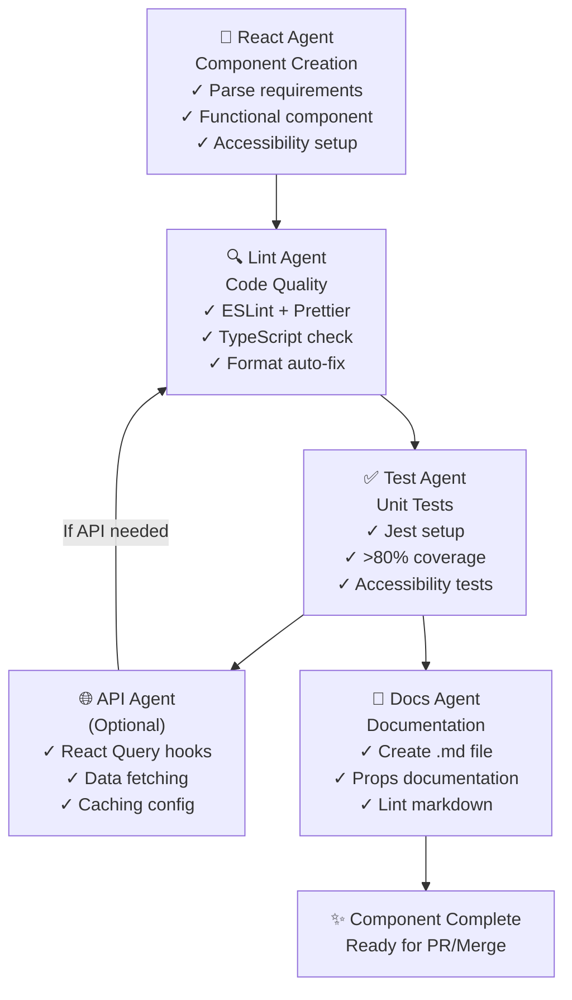
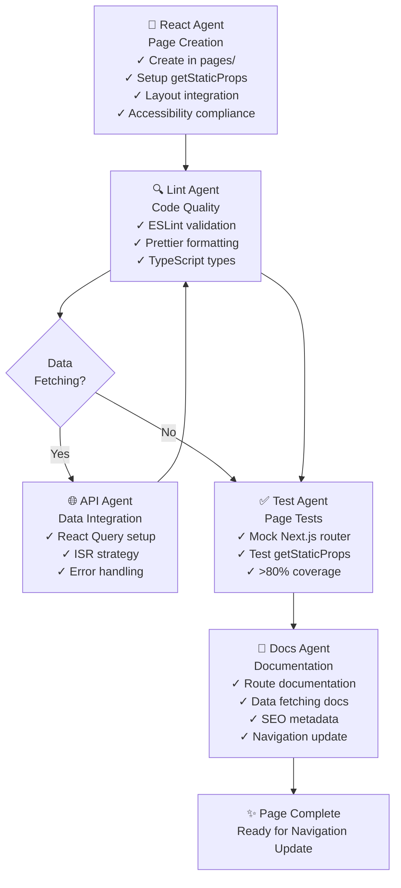
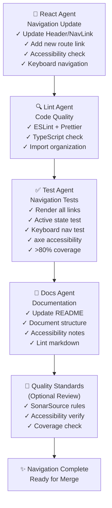

[](http://commitizen.github.io/cz-cli/)
[](https://github.com/prettier/prettier)
[](https://standardjs.com)
[](https://github.com/Loonz206/hello-next/actions/workflows/ci.yml)
[](https://codecov.io/gh/Loonz206/hello-next)
[](https://snyk.io/test/github/Loonz206/hello-next)
[](https://sonarcloud.io/dashboard?id=Loonz206_hello-next)

# hello-next

This is a [Next.js](https://nextjs.org/) project bootstrapped with [`create-next-app`](https://github.com/vercel/next.js/tree/canary/packages/create-next-app).

## Getting Started

First, run the development server:

```bash
npm run dev
# or
yarn dev
```

Open [http://localhost:3000](http://localhost:3000) with your browser to see the result.

You can start editing the page by modifying `pages/index.js`. The page auto-updates as you edit the file.

## Agent Workflows

This project uses specialized agents that work together to ensure code quality, testing, and documentation. The flows below outline the handoff sequences for different development tasks.

### Component Creation Flow

When creating a new React component, agents follow this handoff sequence:



**Key Points**:

- Start with React Agent for component structure
- Lint Agent ensures code quality (auto-fixes available)
- Test Agent validates >80% coverage requirement
- Optional API Agent for data-fetching components
- Docs Agent creates component documentation
- Each step has clear handoff criteria

### Page Creation Flow

When creating a new page, the workflow follows Next.js conventions:



**Key Points**:

- React Agent creates page with Next.js best practices
- Optional API Agent for server-side data fetching
- Lint Agent validates code quality throughout
- Test Agent ensures page functionality and coverage
- Docs Agent documents route, props, and SEO
- Final step prepares for navigation updating

### Navigation Update Flow

When adding new pages to navigation, the workflow ensures consistency:



**Key Points**:

- React Agent updates navigation components
- All components require linting validation
- Test Agent verifies accessibility with axe
- Docs Agent keeps README synchronized
- Optional Quality Standards review before merge
- Each agent hands off specific deliverables

### Agent Directory

All agent instructions are in [`.github/agents/`](.github/agents/):

| Agent                 | File                                                                    | Responsibility               |
| --------------------- | ----------------------------------------------------------------------- | ---------------------------- |
| **React Agent**       | [react.agent.md](.github/agents/react.agent.md)                         | React/Next.js best practices |
| **API Agent**         | [api.agent.md](.github/agents/api.agent.md)                             | React Query & data fetching  |
| **Lint Agent**        | [lint.agent.md](.github/agents/lint.agent.md)                           | Code quality & formatting    |
| **Test Agent**        | [test.agent.md](.github/agents/test.agent.md)                           | Unit & E2E testing           |
| **Docs Agent**        | [docs.agent.md](.github/agents/docs.agent.md)                           | Documentation consistency    |
| **Package Agent**     | [package.agent.md](.github/agents/package.agent.md)                     | Dependency management        |
| **Quality Standards** | [quality-standards.agent.md](.github/agents/quality-standards.agent.md) | Code quality foundation      |

## CI/CD Pipeline

### GitHub Actions Workflows

The repository uses a single workflow file located at [`.github/workflows/ci.yml`](.github/workflows/ci.yml).

#### Triggers

| Event          | Branches / Conditions                          |
| -------------- | ---------------------------------------------- |
| `push`         | `main` branch only                             |
| `pull_request` | All PRs (opened, synchronize, reopened events) |

#### Jobs Overview

The workflow is composed of four jobs that run in sequence:

```
build ──┬── lint ──┐
        │          ├── deploy
        └── test ──┘
```

| Job      | Depends On     | What it does                                                                                                                                                                                 |
| -------- | -------------- | -------------------------------------------------------------------------------------------------------------------------------------------------------------------------------------------- |
| `build`  | —              | Checks out the code, restores the `node_modules` cache, sets up Node.js 22, and runs `npm ci` to install dependencies.                                                                       |
| `lint`   | `build`        | Installs dependencies with `npm install`, then runs `npm run lint` (ESLint), `npm run lint:md` (custom Markdown validator via `scripts/validate-markdown.js`), and `npm run format` (Prettier in `--write` mode to auto-format files). |
| `test`   | `build`        | Installs dependencies with `npm install`, then runs `npm run coverage` (Jest with coverage) and uploads the report to [Codecov](https://codecov.io/gh/Loonz206/hello-next).                  |
| `deploy` | `lint`, `test` | Deploys to Vercel (production). Skipped when the commit message contains `[skip ci]`. See [Vercel Deployment](#vercel-deployment) below.                                                     |

#### Caching

All jobs share a `node_modules` cache keyed on the OS and the hash of `package-lock.json`. This speeds up dependency installation across jobs and improves overall pipeline performance.

---

### Vercel Deployment

The `deploy` job uses the [Vercel CLI](https://vercel.com/docs/cli) to build and deploy the application to production.

#### How it works

1. **Pull environment info** – `vercel pull --yes --environment=production --token=${{ secrets.VERCEL_TOKEN }}` fetches project settings and environment variables from Vercel.
2. **Build** – `vercel build --prod --token=${{ secrets.VERCEL_TOKEN }}` compiles the Next.js application into Vercel's output format.
3. **Deploy** – `vercel deploy --prebuilt --prod --token=${{ secrets.VERCEL_TOKEN }}` uploads the pre-built artifacts to Vercel's CDN.

> In GitHub Actions, each Vercel CLI command passes `--token=${{ secrets.VERCEL_TOKEN }}` to authenticate using the `VERCEL_TOKEN` secret. When running these commands locally, either log in with `vercel login` or provide your own token instead.

#### Required Secrets

Add the following secret to the repository's **Settings → Secrets and variables → Actions** page:

| Secret name    | Description                                                                                                          |
| -------------- | -------------------------------------------------------------------------------------------------------------------- |
| `VERCEL_TOKEN` | A personal access token generated from the [Vercel dashboard](https://vercel.com/account/tokens) (Account → Tokens). |

> **Note:** The deploy job is skipped when the head commit message contains `[skip ci]`, which is useful for documentation-only changes that do not require a new deployment.

---

## Learn More

Learn more about Next.js:

- [Next.js Documentation](https://nextjs.org/docs)
- [Learn Next.js](https://nextjs.org/learn)

You can check out [the Next.js GitHub repository](https://github.com/vercel/next.js/) - your feedback and contributions are welcome!

## Deploy on Vercel

The easiest way to deploy your Next.js app is to use the [Vercel Platform](https://vercel.com/import?utm_medium=default-template&filter=next.js&utm_source=create-next-app&utm_campaign=create-next-app-readme) from the creators of Next.js.

Check out our [Next.js deployment documentation](https://nextjs.org/docs/deployment) for more details.
